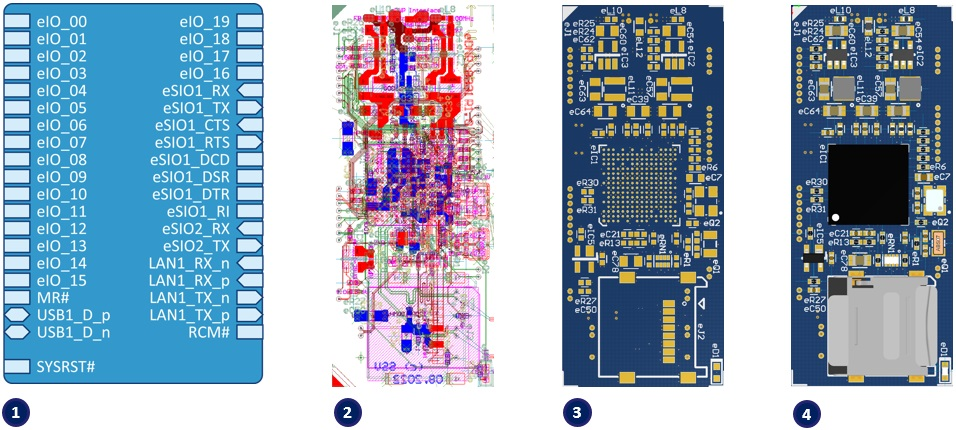
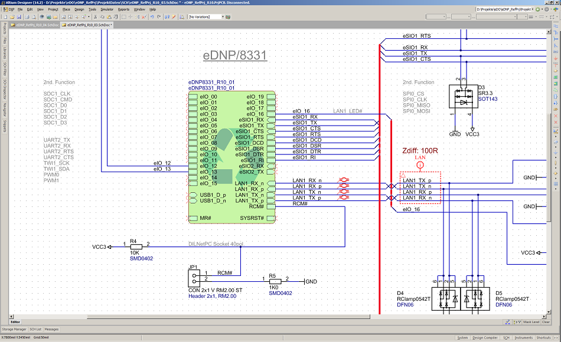
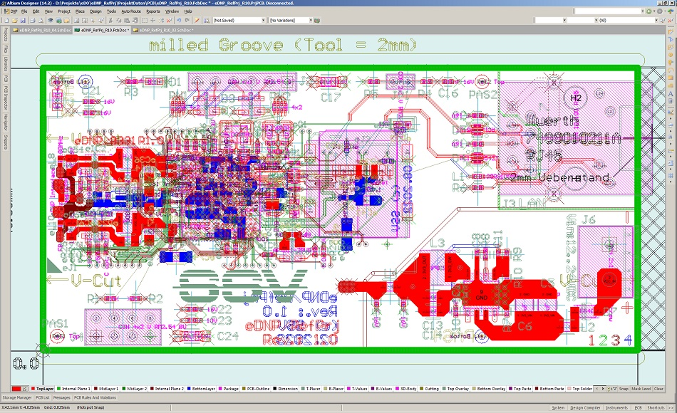
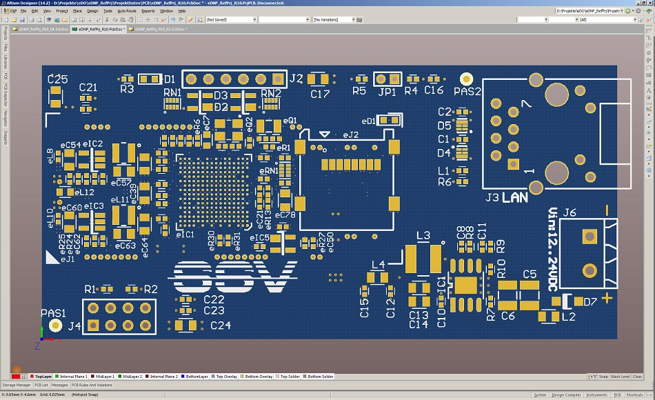
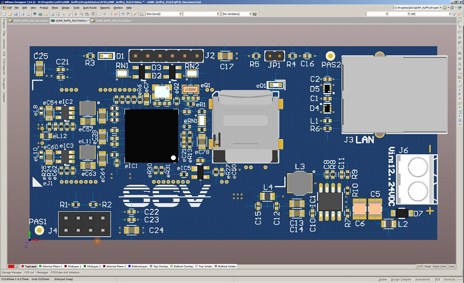

# eDNP/8331: Altium Designer Development Workflow 

There are essentially four steps required to integrate the eDNP/8331 into an embedded system solution using Altium Designer: **1.** Schematic, **2.** Layout, **3.** Bill of Materials (BoM) and production data, **4.** Prototyping 

## 1. Schematic

The first step on the path to an eDNP/8331-based embedded system solution is to create a new Altium Designer project and import the eDNP/8331 CAD files as a root sheet. Within the project, the eDNP/8331 Schematic Snippet is then placed on the Altium Designer workspace and wired to its own circuit functions. Unused eDNP/8331 pins remain unconnected. As external power supply, the eDNP/8331 requires only 3.3 VDC. An external clock and reset signal is not required. For 24 VDC to 3.3 VDC power supply and the use of the eDNP/8331 standard interfaces, such as 10/100 Mbps Ethernet LAN, circuit diagram examples are included.

## 2. Layout

After the schematic is completed and tested, a board layout for the PCB is created from the entire schematic. For this step the eDNP/8331 PCB Snippet is needed. This object can be placed as desired within the PCB space during the Altium Designer PCB design phase. When using the eDNP/8331 PCB snippet, some design rules have to be observed (e.g. some naming conventions, binding of PCB layers for 3.3 VDC power supply, GND, connections to Ethernet LAN connector). The goal of the layout phase is an PCB CAD dataset from which a manufacturer can produce the desired PCBs.

## 3. BoM and Production Data

After finalize the CAD work, it is necessary to create a complete bill of materials with all parts that have been referenced in the Altium Designer schematic as components of the overall circuit. The BOM for the eDNP/8331 schematic snippet is available in Excel format, making it easy to integrate into your own BOM data formats. Based on the complete BOM data as well as the PCB data, the in-house electronics manufacturing or an external Electronic Manufacturing Service (EMS) company can do the electronic circuit board production. However, comprehensive data checks are always required before data is passed on for circuit board production. Design and data errors, that are detected after the first production, are always expensive.

## 4. Prototyping

After the first fully assembled PCBs are available, a verification and validation process are usually run through, which varies in scope and comprehensiveness depending on the corporate culture. In the simplest case, after an electrical test, a copy of the master SD card included in the scope of delivery of an eDNP/8331 Embedded Systems Technology Stack is inserted into the micro SD card holder and the supply voltage is applied to start the eDNP/8331 firmware. In an error-free electronic circuit board production process, both the U-Boot Loader and the Debian Linux operating system will start, so that it is then possible to communicate with the Linux command line using a serial console or with the SSV/WebUI via Ethernet LAN. Further diagnostic programs can now be executed via these two independent UI interfaces in order to run through all the necessary verification and validation steps.

