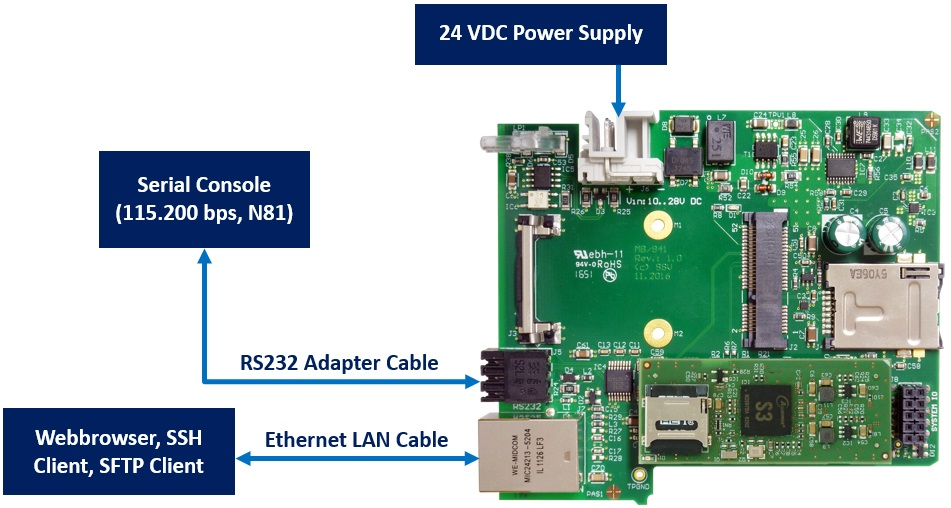

# eDNP/8331: Embedded Linux Module as Intellectual Property 

The eDNP/8331 consists of a microcontroller circuit based on an Arm Cortex-A7 SoC clocked at 1008 MHz, 128 MB of SDRAM, PMICs for all required voltages, and an SD card interface for the firmware. An eDNP/8331 is delivered as a CAD data intellectual property (IP) object for embedded system hardware development with Altium Designer. Accessories include a firmware image with U-Boot boot loader, Debian Linux operating system, SSV/WebUI for device management and configuration tasks plus a C/C++ and Python 3 runtime environment. Furthermore, an I/O Function Library with BLE, NB-IoT, LTE Cat-M1, 4G and numerous other extension functions is available.  

**(1)** eDNP/8331 schematic snippet. This object can be included in an Altium Designer project. The other custom specific circuit functions are wired to the respective snippets pins as required. Unused pins remain unconnected. For power, the eDNP/8331 requires only 3.3 VDC. An external clock and reset signal is not required.

**(2)** Once the circuit is fully wired, the PCB layout for the entire circuit is generated in Altium Designer using the eDNP/8331 PCB snippet. As a result, CAD data for the entire board is available, from which an electronics manufacturing service (EMS) provider can produce the complete assembly.

**(3)** An eDNP/8331 IP can not only be fully integrated into own circuits. Alternatively, it is also possible to implement your own module as a sub-function with individual dimensions, pinout and special additional functions (e. g. BLE, IEEE 802.15.4, Matter). This also allows predefined module slots to be used for an IoT retrofit.

The IP-based eDNP/8331 approach allows a significantly more effective integration into the customer application compared to use of embedded modules as pluggable or soldered physical components. Until now the embedded systems module carrier board was aligned with the module selected in each case in terms of module dimensions, connector or solder mounting area, pinout, etc. If the entire embedded systems module as a CAD data set is available, the schematic and PCB layout can be seamlessly integrated into the customer's own printed circuit board or created as a sub-function module with individual dimensions, pin assignment and additional functions. 

## Technical Data Hardware

* **Processor:** Sochip S3 with Arm Cortex-A7 CPU @ 1008 MHz
* **RAM:** 128 MB DDR3 SDRAM
* **Flash:** 1x microSD card holder
* **Ethernet:** 1x 10/100 Mbps
* **USB:** 1x USB 2.0 host port with max. 480 Mbps
* **UART:** 3x UART (COM1 with all hardware handshake signals, COM2 TX/RX only, COM3 TX/RX/RTS/CTS - functional OR with 4 GPIO signals)
* **SPI:** 1x SPI master controller, functional OR with 4 GPIO signals
* **I2C:** 1x I2C master controller, functional OR with 2 GPIO signals
* **GPIO:** 20-Pin GPIO (General Purpose Input Output)
* **RTC:** 1x Real time clock
* **Watchdog:** 1x Timer watchdog (hardware-based, software-configurable), 1x Power supervisor (hardware-based)
* **Power supply:** 3.3 VDC ±5%
* **Current consumption:** 300 mA typ. / 500 mA max.

For more information please see https://www.ssv-embedded.de/doks/daten/datasheet_ednp8331.pdf (Data Sheet) and https://www.ssv-embedded.de/doks/manuals/hr_dnp8331_en.pdf (Hardware Reference Manual).

## Technical Data Firmware

* **Boot loader:** U-Boot with A/B dual boot partitions
* **Operating system:** Debian Linux (protected APT server access)
* **Webserver:** 	lighttpd with SSL for SSV/WebUI user interface
* **Runtime environment:** Python 3, C/C++
* **IP address assignment:** 	IPv4, IPv6, Static, DHCP, AutoIP, UPnP
* **Protocol stack:** ARP, ICMP, IPv4, IPv6, DHCP (client + server), DNS (incl. DynDNS support), TCP, UDP, FTP, HTTP, SNMP, Telnet, TFTP
* **Security protocols:** OpenSSL/TLS, OpenSSH/SSH, HTTPS, OpenVPN (client + server), SFTP, SNMPv3, PKCS#11 for ATECC secure element
* **TCP server:** Telnet, FTP, HTTP(S), SSH, SFTP
* **Firewall:** netfilter + iptables
* **Proxy functions:** HTTP/HTTPS (web), DNS, FTP, generic TCP port mapping, generic UDP port mapping
* **Machine learning:** TensorFlow Lite interpreter for deep learning
* **Miscellaneous:** C/C++ build environment (compiler etc.); I2C tools with i2cdetect, i2cdump, i2cget and i2cset; CLI tool for ATECC secure element with HMAC- and ECDSA-functions and more 

## Evaluation Kit

The (e)DNP/8331-EK (Evaluation Kit) is suitable as an embedded hardware platform for Python or C/C++ application development. It contains with the DNP/8331 the physical variant of the eDNP/8331 on a MB/941 carrier board. The scope of delivery includes a 110/230 VAC plug-in to 24 VDC power supply unit, an RS232 adapter cable and an Ethernet LAN cable. The RS232 adapter cable can be used to create a serial console to the U-Boot boot loader and Debian Linux operating system if required. The LAN cable is intended as a connection to the DNP/8331-EK user's PC.

When commissioning the DNP/8331 LAN connection, note that the static IPv4 address 192.168.0.126 is preset in the DNP/8331 Linux. Initially, only web browser access via 192.168.0.126:7777 to the SSV/WebUI is possible via the factory setup. Username and password for logging into the SSV/WebUI can be found on a sticker on the back of the MB/941.

The static IPv4 address can be changed via the SSV/WebUI or DHCP can also be activated for automatic acquisition of an IPv4 address. Make sure that you always know the respective IP address. Otherwise you have no SSV/WebUI access to make further setting changes.

The DNP/8331 Linux supports the UPnP service ex works, so you can search for the DNP/8331 in the local Ethernet network from your PC. Alternatively you can of course read out and also change the current IP address at any time via serial console and the Linux command line (see Linux ifconfig command line function).

For more information about the MB/941 carrier board please see https://www.ssv-embedded.de/doks/manuals/hr_mb941_en.pdf.

## Micro How-Tos

* [Altium Designer Development Workflow](HowTos/Altium%20Designer%20Development%20Workflow.md)
* [First Steps with the Evaluation Kit (EK)](HowTos/First%20Steps%20with%20the%20Evaluation%20Kit%20(EK).md)
